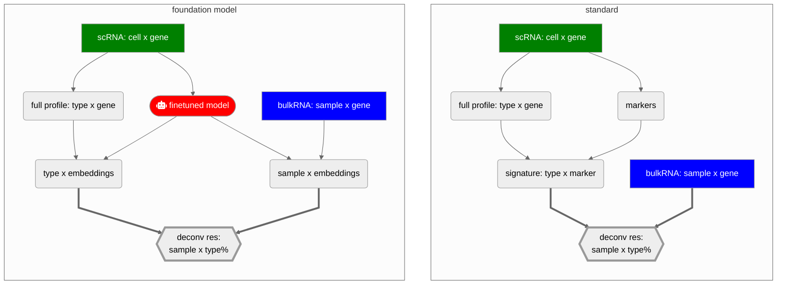

<h1 align="left">
  
</h1>

DECONVersation is a tool designed for the deconvolution of bulk RNA-seq data using embeddings derived from large-scale, LLM-based foundation models. DECONVersation produces robust  cell type proportions by leveraging these high-dimensional embeddings to mitigate batch effects typically present in single-cell reference signature matrices.

---

## Overview

This project provides:

- Installation guide for DECONVersation
- Step-by-step tutorials for embedding extraction and downstream deconvolution analysis
- Sample pseudobulk dataset for deconvolution testing 
- Perfomance evaluation comparing estimates from DECONVersation and other deconvolution tools
- Guide to finetuning foundational models using DECONVersation (Geneformer and Cell2Sentence)

---

## DECONVersation Features

DECONVersation supports end-to-end deconvolution through a set of easy-to-use functions. Geneformer and Cell2Sentence embeddings can be extracted from both bulk and single-cell datasets, with single-cell embeddings used to construct robust signature matrices from .h5ad references. Cell type proportions are then estimated via NNLS directly in embedding space. Built-in benchmarking tools evaluate predictions against ground truth using RMSE and Pearson correlation, complemented by visualization utilities for assessing method performance. DECONVersation also supports testing and validation with in-built pseudobulk functions. 

---

## Tutorials

- [DECONVersation of bulk RNA-seq using Geneformer](tutorials/extracting_embeddings_from_bulk.ipynb): How to extract embeddings (geneformer)and run DECONVersation on bulk using a single cell reference.

---

## Installation

### 1. …

---
