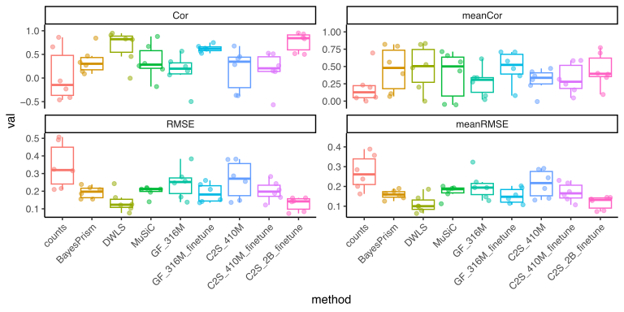

<h1 align="left">
  
</h1>

DECONVersation leverages embedding representations from large-scale, LLM-based foundation models to perform deconvolution of bulk RNA-seq data. This takes advantage of the strengths of scFMs in faithfullly representing transcriptomes, learning meaningful biological networks, and minimizing batch effect and noise. Currently, cell embeddings from [Geneformer](https://huggingface.co/ctheodoris/Geneformer), [Cell2Sentence](https://github.com/vandijklab/cell2sentence), [CellHermes](https://github.com/theislab/CellHermes), and [scGPT](https://github.com/bowang-lab/scGPT) are supported (+PCA and scVI for comparison). 

DECONVersation enables end-to-end deconvolution through a set of easy-to-use functions. Embeddings can be extracted from both bulk and single-cell datasets, with single-cell embeddings used to construct robust signature matrices from .h5ad references. Cell type proportions are then estimated via NNLS directly in embedding space. Built-in benchmarking tools evaluate predictions against ground truth using RMSE and Pearson correlation, complemented by visualization utilities for assessing method performance. DECONVersation also supports testing and validation with in-built pseudobulk functions. 

---

## Benchmarking 

DECONVersation was benchmarked across 6 real bulk RNA-seq datasets with ground truths, spanning diverse tissue types and experimental conditions, to evaluate deconvolution performance and generalizability.

<h1 align="left">
  
</h1>

<b> Summary </b>  
Across 6 benchmarked datasets, we calculate overall RMSE and correlation coefficient alongside mean RMSE and correlation averaged across cell types. Fine-tuned Cell2Sentence and Geneformer-based embeddings both demonstrate consistent deconvolution performance across all 6 datasets, with fine-tuned models outperforming their zero-shot counterparts in each case. Though zero-shot performance is already comparable to some common tools in the field, this highlights the benefit of fine-tuning (training models to predict cell type annotations from a single-cell reference). Among the tested tools, only DWLS R pacakge achieves comparable performance to the fine-tuned embedding-based approaches available in DECONVersation.

| # | Dataset | Source | Ground Truth | Cell Type # | 
| -------- | -------- | --------  | --------  | --------  |
| 1 | [PMBC (Hoek)](https://journals.plos.org/plosone/article?id=10.1371/journal.pone.0118528)| PBMC | FACS | 5 |
| 2 | [PMBC (Finotello)](https://pubmed.ncbi.nlm.nih.gov/31126321/)| PBMC | FACS | 5 |
| 3 | [PMBC (Morandini)](https://pmc.ncbi.nlm.nih.gov/articles/PMC10828344/)| PBMC | FACS | 5 |
| 4 | [Cell Line Mixture (Cobos)](https://europepmc.org/article/med/37528411)| Cell Line Mixture| Mixture Count | 6 |
| 5 | [Pre-Frontal Cortex (Huuki-Myers)](https://pubmed.ncbi.nlm.nih.gov/38781370/)| DLPFC | RNAScope/IF | 6 |
| 6 | [Retina (Guo)](https://pmc.ncbi.nlm.nih.gov/articles/PMC11789644/)| Retina | snRNA | 6 |

---

## Installation
While DECONVersation itself is lightweight and easy to install with `pip install DECONVersation`, the various single cell foundation models themselves are not. In fact, due to dependency restrictions, they will never be compatible in the same python environment. DECONVersation works around this by detecting and only loading the available model(s). For each scFM model and package, users should consult the correpsonding official installation guides. We also provide conda env yaml files in the `envs` directory that are reproducibly operational on our hardware (NVIDIA L40S), each corresponding to one of the scFMs + DECONVersation. They can be installed with e.g. `conda env create -f deconv_gf.yml`.

---

## Tutorials

- [DECONVersation on bulk RNA-seq using Geneformer](tutorials/extracting_embeddings_from_bulk.ipynb): Extract embeddings and deconvolute on bulk against a single cell reference.
- [DECONVersation on pseudobulk using Geneformer](tutorials/extracting_embeddings_from_pseudobulk_geneformer.ipynb): Validate deconvolution using pseudobulk data.

---

## Suggested Reading
- [Geneformer](https://www.nature.com/articles/s41586-023-06139-9) Transfer learning enables predictions in network biology
- [Cell2Sentence](https://pmc.ncbi.nlm.nih.gov/articles/PMC11565894/) Cell2Sentence: Teaching Large Language Models the Language of Biology
- [CellHermes](https://www.biorxiv.org/content/10.1101/2025.11.07.687322v1) Language may be all omics needs: Harmonizing multimodal data for omics understanding with CellHermes
- [scGPT](https://www.nature.com/articles/s41592-024-02201-0) scGPT: toward building a foundation model for single-cell multi-omics using generative AI
---
